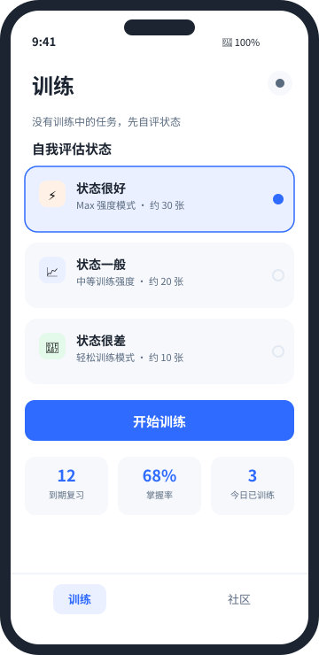
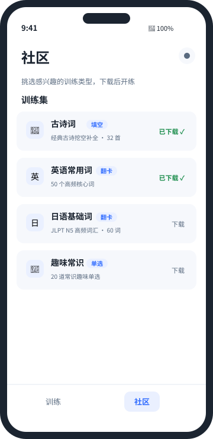

# Memcoach 记忆教练

> 你的记忆教练：先自评状态（很好 / 一般 / 很差），App 匹配对应训练强度
> （Max / 中等 / 轻松），把社区下载的训练集与到期卡片智能组队，
> 用间隔重复（SM-2）帮你真正记住——遗忘曲线证明进步。

依据《记忆教练App架构设计》《开发计划-分阶段功能路线》《技术调研-核心技术选型》
实现的 **训练侧独立版**（训练闭环 + 社区训练集）。

## 界面预览

<div align="center">
  <table>
    <tr>
      <td align="center"><b>训练 · 自评强度</b></td>
      <td align="center"><b>社区 · 训练集</b></td>
    </tr>
    <tr>
      <td></td>
      <td></td>
    </tr>
  </table>
</div>

## 当前版本能力（v0.2.0）

- **两 Tab 常驻**：训练（默认落点）/ 社区，IndexedStack 保状态
- **自评强度训练**：状态很好 → Max 强度 · 状态一般 → 中等 · 状态很差 → 轻松；
  强度决定一轮题量、SM-2 间隔增幅、新卡 vs 复习卡比例、时长上限
- **训练闭环**：已下载训练集的新卡 + 到期卡片智能组队，闪卡先猜后看、
  三键评级（忘了 / 模糊 / 记得）→ SM-2 调度
- **社区训练集**：翻卡 / 单选 / 填空三类玩法（内置古诗词、英语常用词、
  日语基础词、趣味常识），下载即训；内容目录抽象化（内置 + 预留远程）
- **数据证明**：遗忘曲线（fl_chart 周视图，个人正确率 vs 理论基线）、
  掌握率 / 积压 / 每日训练热力图
- **免费额度**：非 Pro 无限训练、卡片 100 张（超限引导订阅）
- **数据所有权**：全部数据本地存储（drift/SQLite，本地优先），一键导出 JSON

## 技术栈（按技术调研选型）

Flutter（stable 线） · Riverpod（flutter_riverpod，无 codegen） ·
drift（SQLite，6 张表：words/cards/items/review_log/item_tags/training_sets）·
fl_chart · shared_preferences（设置 KV）

## 工程结构（feature-first）

```
lib/
  core/       主题
  domain/     SM-2 引擎、训练强度（纯 Dart，可单独单测）
  content/    训练集内容模型 + 内置目录（远程目录扩展点）
  data/       drift 表/库、仓储（训练集/训练/统计）、设置、导出
  features/   training（训练）/ community（社区）/ settings
  shared/     空态、大标题等通用组件
```

## 开发命令

```bash
# 环境（国内镜像已写入 ~/.bashrc）
export PATH="/media/luskyle/DATA/apps/flutter_dl/flutter/bin:$PATH"

# 依赖与代码生成（drift 表变更后重新生成 database.g.dart）
flutter pub get
dart run build_runner build --delete-conflicting-outputs

# 静态检查与测试（M0 验收：analyze 零问题 + test 全绿）
flutter analyze
flutter test

# 运行（Linux 桌面需安装 clang；移动端在 Android Studio/Xcode 中运行）
flutter run
```

> 平台说明：本项目数据层使用 drift/SQLite（`dart:ffi`），**不支持 Web 编译**
> （路线图亦未包含 Web；V2 目标是 Windows/macOS 桌面端）。

## CI / CD（GitHub Actions）

- `.github/workflows/ci.yml`：main 分支 push / PR → `flutter analyze` + `flutter test`（质量门禁）
- `.github/workflows/release.yml`：推送 `v*` 标签（或手动 workflow_dispatch 指定 tag）→
  质量门禁 → 构建 Android APK / Linux tar.gz / iOS 未签名包 → 自动生成中文发布说明 →
  发布 GitHub Release（含全部产物；重复触发自动更新）
- 发布说明由 `scripts/gen_release_notes.sh` 从 git log 按 Conventional Commits 分组生成
- 官网（`docs/index.html`，纯静态、零构建依赖）：<https://luskyle.github.io/memcoach/>（GitHub Pages：Settings → Pages → `Deploy from a branch` → `main` / `docs`）

发布前需在仓库配置（可选）：
- GitHub Secrets（Android 正式签名，缺省时自动回退 debug 签名发布）：
  `ANDROID_KEYSTORE`(base64 的 .jks) / `ANDROID_KEYSTORE_PASSWORD` / `ANDROID_KEY_ALIAS` / `ANDROID_KEY_PASSWORD`
- iOS 正式发布需 Apple 证书（当前产出未签名包）

```bash
# 出包：打标签即触发（版本号与 pubspec.version 保持一致）
git tag v0.2.0 && git push origin v0.2.0
```

## 测试

- `test/domain/sm2_test.dart`：SM-2 引擎 20+ 用例（忘记/模糊/记得、间隔边界、
  重学路径、EF 钳制 1.3~3.0、到期判定、掌握度投影、长周期稳定性）
- `test/domain/language_test.dart`：多语言自动标注启发式
- `test/domain/training_intensity_test.dart`：强度预设（题量/新卡比/间隔增幅/时长）与间隔钳制
- `test/data/training_set_repository_test.dart`：训练集安装、按需引入、卸载保留已训练卡
- `test/widget/app_smoke_test.dart`：两 Tab 导航与空态
- `test/widget/training_flow_test.dart`：训练闭环（翻卡→评级→落库）、重学路径、状态投影

## 与规划的差距（后续版本）

- SM-2 → FSRS（review_log 已保留完整字段，≥4 周数据后可切换）
- OCR / 分享面板 / Anki 导入导出（V1.1）
- 云盘同步 B 档、云端日志 C 档（V1.2 / V2）
- 内购接入（阶段 2，当前订阅墙为方案占位）
- 词库管线：Python 清洗 JLPT/COCA → JSON 导入（当前为内置微型样例词库）

## 开源协议

本项目采用 [Apache License 2.0](LICENSE) 开源。